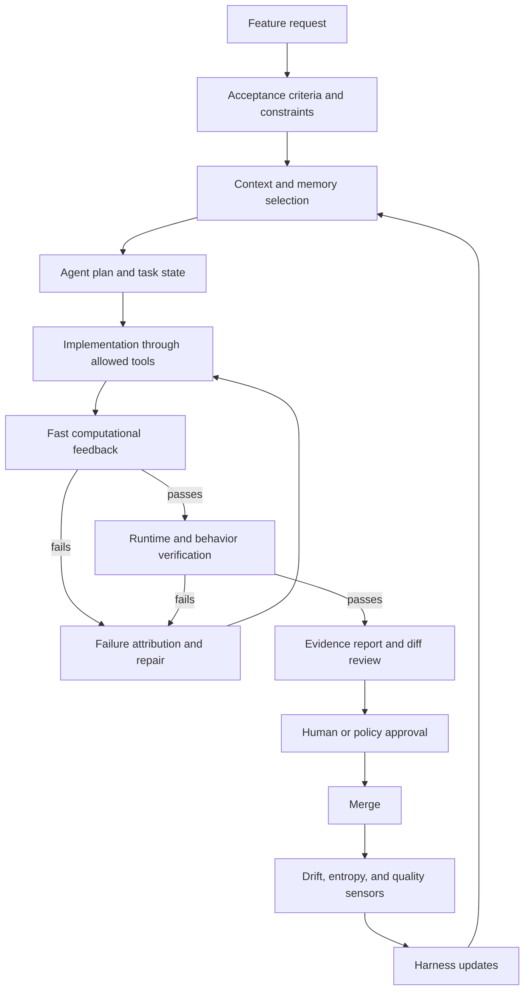

# Harness Control Layers For Autonomous Development

Research date: 2026-06-15

## Control Philosophy

Harness engineering treats an autonomous coding agent as a powerful but nondeterministic worker operating inside a controlled development environment. The harness does not try to make the model deterministic. It constrains the agent's operating conditions, gives it high-signal feedback, records its behavior, and refuses to treat work as complete until there is evidence.

The control system has three complementary dimensions:

- Feedforward guides: information provided before or during implementation, such as specs, `AGENTS.md`, architecture rules, testing guides, API docs, and examples.
- Feedback sensors: checks that inspect what the agent produced, such as tests, type checks, linters, static analysis, security scanners, visual tests, runtime traces, review agents, and human review.
- Governance targets: the aspects being regulated, including maintainability, architecture fitness, behavior, security, performance, operability, and long-term entropy.

## Layer Model

| Layer | Purpose | Typical controls | Failure prevented |
| --- | --- | --- | --- |
| 1. Intent and acceptance | Define what the feature must accomplish and what "done" means. | Product brief, explicit acceptance criteria, non-goals, risk notes, edge cases, definition of done. | Misunderstood requirements, unnecessary features, premature completion. |
| 2. Context and memory | Make project knowledge available in agent-readable form. | `AGENTS.md`, architecture docs, testing guides, domain glossary, known failures, service templates, dependency maps. | Wrong-file edits, guessed APIs, repeated rediscovery, wrong-layer fixes. |
| 3. Planning and task state | Keep long-running work coherent across tool calls and context compaction. | Plan file, task-state log, inspected-file list, assumptions, open questions, verification checklist. | Drift, duplicated effort, incoherent execution, forgotten constraints. |
| 4. Tool and action surface | Expose the actions the agent can safely take. | Tool registry, command registry, code search, test runners, browser automation, screenshot tools, profilers, debuggers. | Inability to inspect, reproduce, test, or verify work. |
| 5. Permission and safety | Bound the blast radius of autonomous action. | Sandboxes, scoped credentials, branch isolation, approval gates, destructive-command policy, dependency-install policy. | Unsafe edits, data exposure, accidental deletion, unauthorized deployment. |
| 6. Computational verification | Catch objective failures cheaply and early. | Unit tests, integration tests, type checks, build checks, lint, format, coverage, dependency rules, Semgrep, architecture tests. | Structural defects, regressions, style drift, dependency violations, security smells. |
| 7. Inferential review | Catch semantic issues that deterministic tools cannot fully express. | LLM code review, architecture review, product-review agents, test-quality review, prompt-based judges over traces or screenshots. | Overengineering, shallow fixes, semantically duplicated code, weak tests, design mismatch. |
| 8. Runtime observability | Verify actual behavior, not just static properties. | Logs, traces, metrics, SLO probes, browser videos, screenshot comparisons, replayable bug reproduction. | False confidence from green tests, hidden runtime failures, poor diagnostics. |
| 9. Evidence and audit | Make completion reviewable and repeatable. | Verification report, action trace, tool trace, context trace, failure-attribution log, intervention log, entropy audit. | Unverified success claims, invisible human scaffolding, unreviewable agent behavior. |
| 10. Entropy and maintenance | Prevent quality decay across many agent changes. | Drift scans, dead-code detection, dependency audits, documentation freshness checks, recurring cleanup agents, refactoring PRs. | Compounding technical debt, stale docs, inconsistent patterns, repository clutter. |

## H0-H3 Harness Maturity Ladder

The "AI Harness Engineering" preprint proposes a useful ladder for separating model capability from harness support. Adapted for development work:

| Level | What the agent gets | Development capability |
| --- | --- | --- |
| H0: Minimal baseline | Task description and repository files. | The agent can attempt a change, but behavior depends heavily on implicit model priors and ad hoc exploration. |
| H1: Tool harness | H0 plus tool registry, test-command registry, and tool-use protocol. | The action surface becomes explicit and traceable. The agent can inspect, run, and validate through known commands. |
| H2: Context-memory harness | H1 plus project memory, architecture docs, testing guide, task state, known failures, and context-selection protocol. | The agent can work with local conventions instead of rediscovering them. Context use becomes explicit and auditable. |
| H3: Observability-verification harness | H2 plus deterministic check registry, bug-reproduction protocol, failure-attribution protocol, verification protocol, and verification-report template. | Completion becomes evidence-backed. The agent must prove behavior, explain failures, and show coverage of requirements. |

## Control Flow During Feature Development

## Feedforward Controls

Feedforward controls steer the agent before a mistake happens.

- Repository rules: `AGENTS.md`, `CLAUDE.md`, or equivalent agent instructions.
- Architecture rules: module boundaries, layering rules, API contracts, data-shape validation standards, observability standards.
- Testing rules: which command to run, how to add tests, fixtures to use, mutation or coverage expectations, browser or screenshot workflow.
- Domain rules: business invariants, terminology, edge cases, compliance constraints, security policies.
- Work templates: service templates, task templates, pull-request templates, verification-report templates.
- Known failure memory: recurring agent mistakes, bad patterns, avoidable interventions, and "never do this here" rules.

## Feedback Sensors

Feedback sensors tell the agent or reviewer whether the work is acceptable.

- Fast local sensors: formatting, lint, type checks, targeted tests, dependency graph checks.
- Structural sensors: architecture boundary tests, module-cycle checks, coverage gates, dead-code detection.
- Behavior sensors: unit tests, integration tests, end-to-end tests, approval fixtures, browser automation, screenshot/video evidence.
- Security sensors: dependency audit, secrets scan, SAST rules, permission checks, threat-model checklist.
- Performance sensors: microbenchmarks, load tests, latency budgets, memory checks.
- Semantic sensors: LLM review, architecture review, product review, test-quality review.
- Continuous sensors: post-merge drift monitors, SLO monitors, log anomaly checks, stale-doc checks, recurring cleanup scans.

## Human Control Points

Autonomy does not remove human control. It moves it to higher-leverage points.

- Before work: define priority, scope, acceptance criteria, non-goals, and risk tolerance.
- During work: answer ambiguous product or architecture questions, approve risky actions, and inspect blocked runs.
- Before merge: validate the evidence report, user-visible behavior, risk assessment, and residual uncertainty.
- After merge: inspect escaped defects, repeated review comments, quality drift, and avoidable interventions, then update the harness.

## Minimum Viable Harness For A Repository

For a team starting from zero, the smallest useful harness is:

1. `AGENTS.md` with project structure, coding standards, test commands, review expectations, and known anti-patterns.
2. A task template with acceptance criteria, non-goals, risk level, and required evidence.
3. A command registry listing safe build, test, lint, type-check, and local-run commands.
4. A verification-report template that maps each requirement to evidence.
5. A policy for destructive commands, dependency changes, credentials, migrations, and deployment.
6. A recurring process that converts repeated agent mistakes into rules, tests, tools, or docs.

